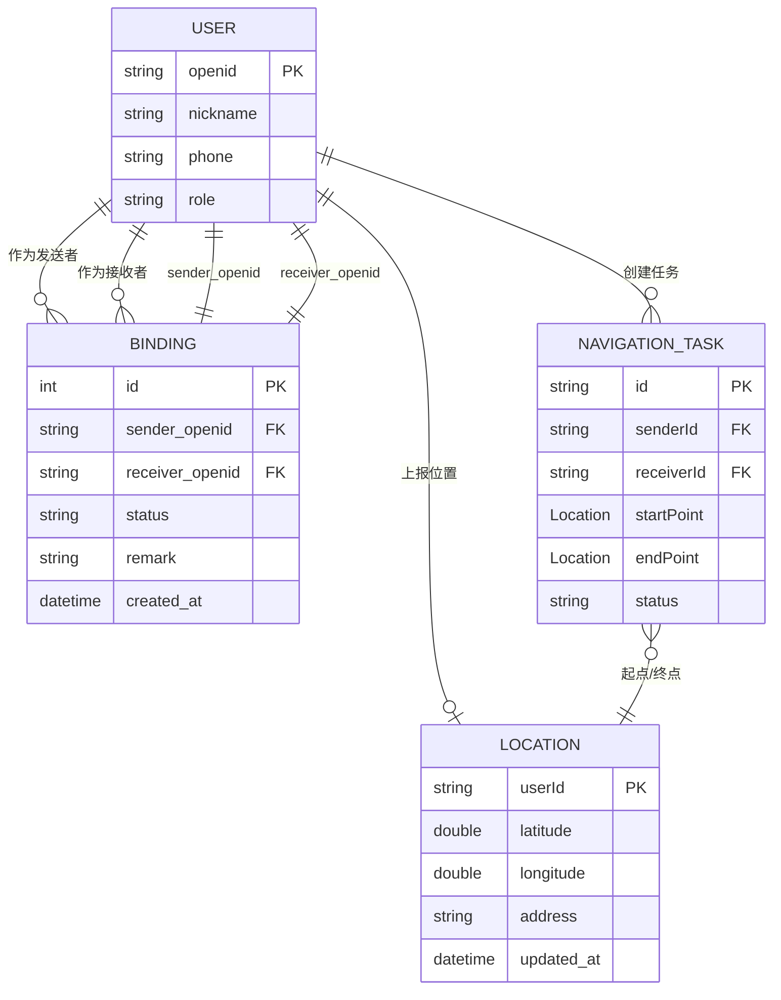

# Models 目录

数据模型定义，使用 Freezed + json_serializable 代码生成。

## 目录结构

```
models/
├── async_state.dart           # 异步操作状态模型（loading/data/error）
├── async_state.freezed.dart   # Freezed 生成代码（不要手动修改）
├── auth_result.dart           # 认证结果模型
├── auth_result.freezed.dart   # Freezed 生成代码
├── binding.dart               # 绑定关系数据模型
├── binding.g.dart             # json_serializable 生成代码
├── location.dart              # 地理位置数据模型
├── location.g.dart            # json_serializable 生成代码
├── login_info.dart            # 登录信息模型
├── navigation_task.dart       # 导航任务数据模型
├── navigation_task.g.dart     # json_serializable 生成代码
├── user.dart                  # 用户数据模型
├── user.g.dart                # json_serializable 生成代码
├── user_credentials.dart      # 用户凭据模型
├── user_state.dart            # 用户状态模型
└── user_state.freezed.dart    # Freezed 生成代码
```

## 文件说明

| 文件 | 作用 | 代码生成 |
|------|------|----------|
| `async_state.dart` | 异步操作状态模型（loading/data/error），使用 Freezed 联合类型 | Freezed |
| `auth_result.dart` | 认证结果模型（成功/失败/错误信息） | Freezed |
| `binding.dart` | 绑定关系数据模型（双方信息、状态、时间） | json_serializable |
| `location.dart` | 地理位置数据模型（经纬度、地址描述） | json_serializable |
| `login_info.dart` | 登录信息模型（手机号、验证码等） | - |
| `navigation_task.dart` | 导航任务数据模型（目标位置、路线信息） | json_serializable |
| `user.dart` | 用户数据模型（昵称、头像、角色等） | json_serializable |
| `user_credentials.dart` | 用户凭据模型（Token、过期时间） | - |
| `user_state.dart` | 用户状态模型（登录态/未登录态），使用 Freezed | Freezed |

## 模型关系图（ER 图）



### 关系说明

| 关系 | 说明 |
|------|------|
| `User` ↔ `Binding` | 一个用户可以有多个绑定关系（作为发送者或接收者） |
| `Binding` ↔ `User` | 每个绑定关系关联两个用户（sender 和 receiver） |
| `User` → `Location` | 用户可以上报当前位置（一对零或一） |
| `User` → `NavigationTask` | 用户可以创建多个导航任务 |
| `NavigationTask` → `Location` | 导航任务包含起点和终点位置 |

### 独立模型

| 模型 | 用途 | 与其他模型关系 |
|------|------|---------------|
| `LoginInfo` | **存储层模型**：完整登录信息（含 Token、角色、保存时间） | 独立，用于 `SecureStorage` 读写 |
| `UserCredentials` | **传输层模型**：简化凭据（仅 userId、phone、accessToken） | 独立，用于路由导航传参 |
| `AsyncState<T>` | 异步操作状态联合类型 | 独立，通用状态管理 |
| `AuthResult` | 认证结果联合类型 | 独立，认证流程专用 |

### 为什么 `LoginInfo` 和 `UserCredentials` 是两个独立的模型？

虽然两者都包含 Token 信息，但职责不同：

| 维度 | `LoginInfo` | `UserCredentials` |
|------|------------|------------------|
| **职责** | 存储层模型：完整的登录信息持久化 | 传输层模型：简化凭据用于路由传参 |
| **字段数量** | 8 个字段（含保存时间、角色等） | 3 个字段（仅核心凭据） |
| **使用场景** | `SecureStorage` 读写、登录状态检查 | 路由导航时传递参数，避免重复传多个参数 |
| **生命周期** | 长（持久化存储） | 短（页面间传递） |

**结论**：两者职责独立，应保留两个文件。

---

## 代码生成

修改 `.dart` 源文件后，运行以下命令重新生成代码：

```bash
# 生成所有 Freezed + json_serializable 代码
flutter pub run build_runner build --delete-conflicting-outputs

# 监听模式（自动重新生成）
flutter pub run build_runner watch --delete-conflicting-outputs
```

## 使用方式

### 统一导入（推荐）

```dart
// 一次性导入所有模型
import 'package:qintu/models/index.dart';
```

### 单独导入（按需）

```dart
// 创建模型
final user = User(
  openid: 'xxx',
  nickname: '测试用户',
  role: AppRole.sender,
);

// JSON 序列化
final json = user.toJson();
final userFromJson = User.fromJson(json);

// 使用 Freezed 联合类型
final state = AsyncState.loading();
// 或
final state = AsyncState.data(userData);
// 或
final state = AsyncState.error('网络错误');

// pattern matching
state.when(
  loading: () => CircularProgressIndicator(),
  data: (data) => Text(data),
  error: (e) => Text(e),
);
```

## 规范

- `.freezed.dart` 和 `.g.dart` 文件是自动生成的，**不要手动修改**
- 新增模型文件后记得运行 `build_runner`
- 使用 Freezed 的 immutable 特性避免意外修改状态
